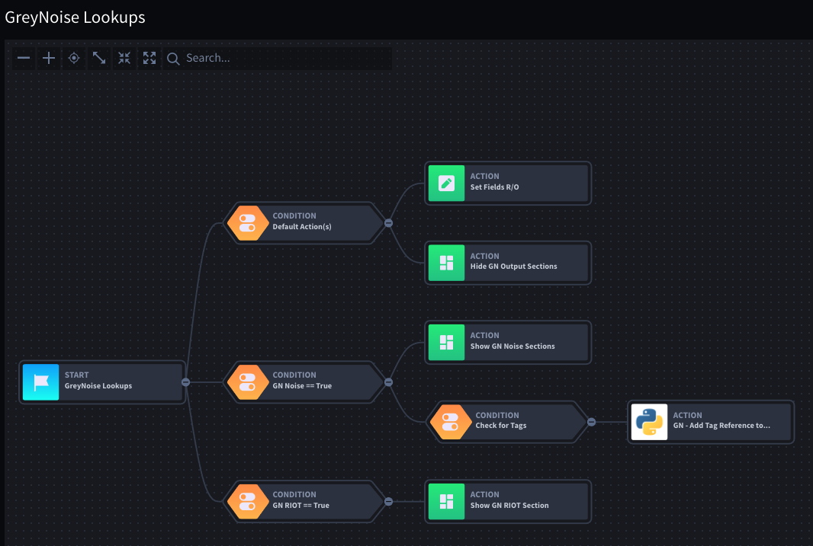

# Additional Content
This folder includes some additional content that is not directly part of the integration, but may help in deploying
and better utilizing the GreyNoise integration within the Swimlane platform.

## Applets
This folder includes additional Applets that allow a Swimlane admin to quickly deploy the GreyNoise integration.  The 
following applets are included at this time:

* GreyNoise Lookup Applet - Used with the Quick, Context and RIOT lookups and includes all needed fields
* GreyNoise Tags Applet - Used with the Get AlL Tags task and includes all Tag Details fields.
* GreyNoise Alerts Applet - Used with the Query Task when setting up GreyNoise as an alerting source

## Add Tag Refs to GreyNoise Lookups Helper Script
This script is a custom python3.6 script that allows for references to TAG details to be added to a GreyNoise IP
Lookup using Swimlane References fields.

### Prerequisites
In order for this script to work, Swimlane needs to be set up as follows:
* An application dedicated for GreyNoise tags that runs the Get All Tags Action once a day to populate tag details into
Swimlane.  The script assumes the name of this Application will be `GreyNoise Tags`
* Within the application where the GreyNoise Lookup data is being stored a Reference Field exists that is linked
to the GreyNoise Tags application.  This script assumes the name of the reference field is `Tags Reference`
* Within the application where the GreyNoise Lookup data is being stored the GreyNoise tags are stored in a list field. 
  The script assumes the name of the list field is `GN Tags`
  
### Setup
* Within the Application that the GreyNoise Lookups are being performed, create a Custom Python3 task
* In the workflow of the Application, create a conditional that checks for the existance of tags being returned
from the GreyNoise lookup.  If the conditional is matched, create an action that first off the new integration script

## Workflow Example
The following is an example of what the GreyNoise Lookup workflow could look like:
